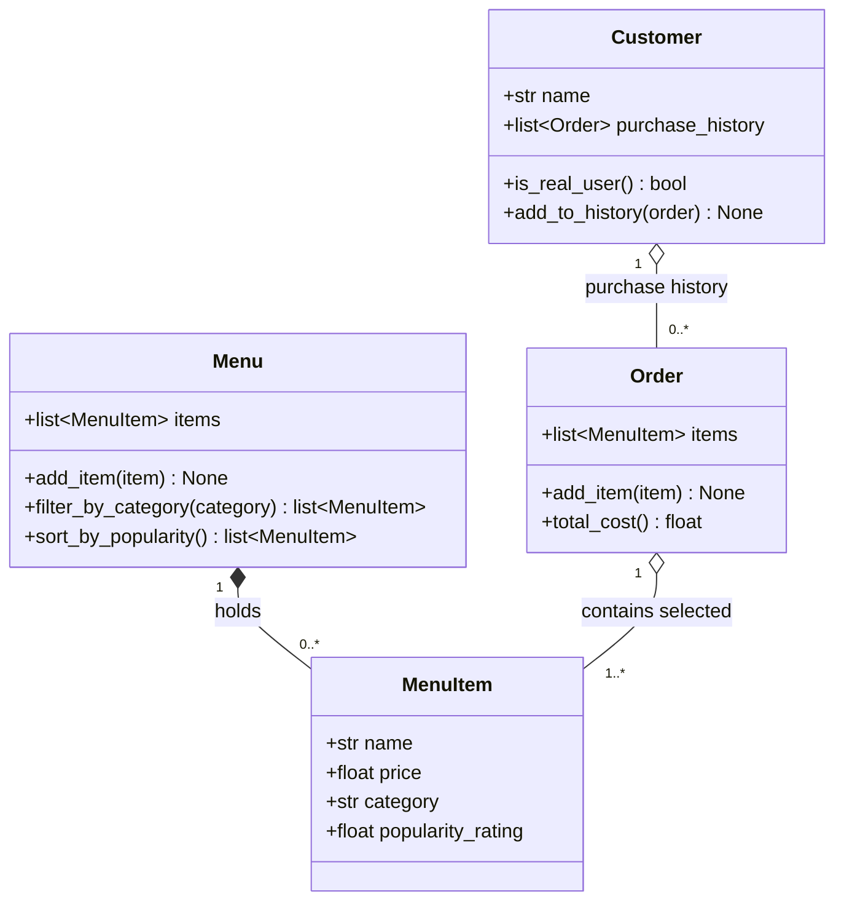

# ByteBites — Final UML Design

> Generated **with `ByteBites_Design_Reference.md` attached**, then verified
> against `bytebites_spec.md`. Exactly four classes, each carrying only the
> attributes and behavior the feature request describes.

## Class Diagram

## What each class represents (one sentence each)

- **Customer** — a real app user, identified by their `name`, whose
  `purchase_history` (a list of past `Order`s) lets the system confirm they are a
  genuine user.
- **MenuItem** — one sellable food item described by its `name`, `price`,
  `category`, and `popularity_rating`.
- **Menu** — the full collection of `MenuItem`s, with the ability to filter that
  collection by `category` and sort it by `popularity_rating`.
- **Order** — a single transaction holding the `MenuItem`s a user selected and
  able to compute their `total_cost`.

## Relationships

| From | To | Meaning |
| --- | --- | --- |
| `Menu` ◆— `MenuItem` | composition | the menu owns the full list of items |
| `Order` ○— `MenuItem` | aggregation | an order references selected items |
| `Customer` ○— `Order` | aggregation | a customer accumulates past orders |

## How this differs from `draft_from_copilot.md`

| Un-bounded draft | Final (with reference file) |
| --- | --- |
| 8 classes incl. `User`, `Payment`, `Database`, `RecommendationEngine` | **4 classes**, exactly the candidates |
| Auth: `password_hash`, `login()`, `is_authenticated()` | **No auth** |
| Persistence: `Database.connect/save/load` | **No database layer** |
| Extra fields: `email`, `phone`, `calories`, `image_url`, `status`… | **Only spec'd attributes** |
| Inheritance + payment/DB relationships | **Three simple has-a relationships** |

The reference file's *Project Scope* and *Behavioral Instructions* are what
pulled the design back to the specification instead of letting it sprawl.
