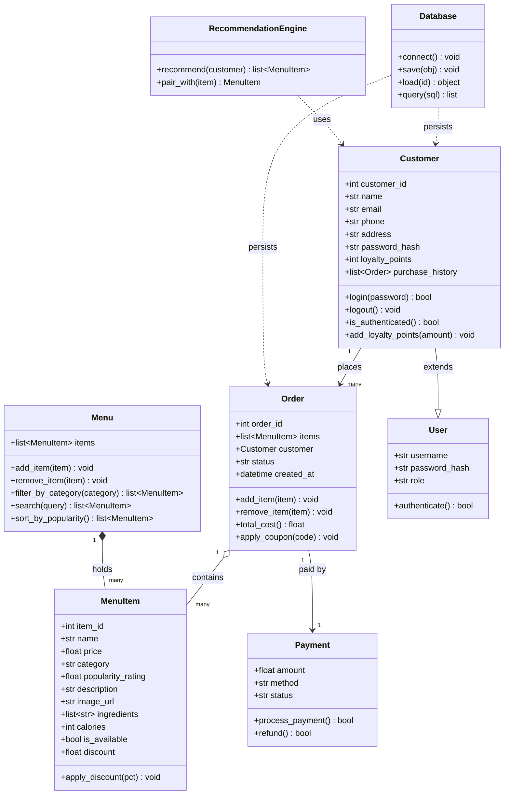

# Draft UML — from standard chat (no reference file)

> ⚠️ This is the **first, un-bounded draft**. It was generated from a plain chat
> prompt with no project guardrails. Notice the scope creep: it invents classes
> and attributes the feature request never asked for. Kept here only so we can
> compare it against the refined design.

## What's wrong with this draft (review notes)

- **Adds classes the spec never mentions:** `User`, `Payment`, `Database`,
  `RecommendationEngine`. The request is for four core data objects only.
- **Adds authentication:** `password_hash`, `login()`, `is_authenticated()`,
  `authenticate()` — the reference file explicitly excludes auth.
- **Adds a persistence layer:** `Database` with `connect/save/load/query` — no
  database was requested.
- **Over-stuffs attributes:** `email`, `phone`, `address`, `loyalty_points`,
  `calories`, `ingredients`, `image_url`, `discount`, `order_id`, `status`,
  `created_at` — none of these appear in the feature request.
- **Invents relationships:** `Customer --|> User` inheritance, payment links, DB
  dependencies — all noise relative to what was asked.

➡️ These notes drive the cleanup in `bytebites_design.md`.
